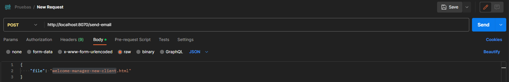

## Como usar Testing Mails

- Instala las dependencias: npm i
- Crea un archivo .env con la misma estructura que .env.example y completa las variables (Pídeselas al propietario del proyecto)
- Levanta el proyecto: npm run dev
- Ya puedes hacer peticiones en Postman: http://localhost:8070/send-email (Método POST)
- En el body de Postman, en raw:  { "file": "nombre_de_la_plantilla.html" }
  
- Para cargar tu plantilla añadela a la carpeta "templates" y llamala desde el parámetro "file" del body introducido en Postman.

**Importante:** Si vas a enviar plantillas con formato .pug, tienes dos opciones o borrar las variables de la plantilla o en el controlador agregarlas al pug.renderFile.